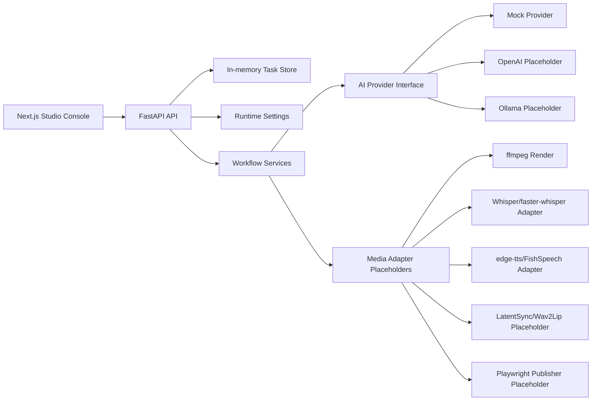

# Architecture

DevShorts AI is a mock-first AI short-video workflow studio with a semi-real local media pipeline. The architecture is split into a web console, an API orchestration layer, provider adapters, local runtime settings, and future media/model integrations.

## System Overview

## Frontend

`apps/web` is a Next.js App Router application. It contains three MVP screens:

- Dashboard: system status, model service status, GPU/CPU/RAM mock telemetry, recent tasks.
- Studio: step-by-step short-video workflow with live status updates and task logs.
- Settings: API key, local model, inference, TTS, and video output configuration UI.

The UI is optimized for demos and short-form recording: dark theme, status lights, dense cards, timeline pipeline, and console-style logs.

## Backend

`apps/api` is a FastAPI application with these layers:

- `app/api/routes`: HTTP routes grouped by health, system, models, tasks, and workflow.
- `app/services`: workflow modules with mock implementations and future integration boundaries.
- `app/providers`: provider interface plus mock/OpenAI/Ollama placeholders.
- `app/models`: Pydantic request/response models.
- `app/core/config.py`: environment-driven settings.
- `app/services/settings_service.py`: runtime provider settings persisted under `artifacts/runtime-settings.json`.

## Task Flow

Task creation stores a task in the local in-memory store. Mock tasks advance on polling for screen recording. Semi-real tasks run in a background thread and write artifacts under `artifacts/outputs/{taskId}/`. Each workflow step moves through `pending`, `running`, and `success`, with logs appended as the task progresses.

The intended future replacement is Redis/Celery:

- Keep the API route contracts stable.
- Replace `TaskService` storage and background simulation with durable queue jobs.
- Emit realtime updates through WebSocket/SSE after the polling MVP.

## Provider Strategy

All model-facing work should go through provider/service adapters:

- LLM: `LLMProvider`
- ASR: `ASRService`
- TTS: `TTSService`
- Digital Human: `DigitalHumanService`
- Video Render: `VideoRenderService`
- Publishing: `PublishService`

The project ships with mock providers, ffmpeg media steps, edge-tts, FishSpeech HTTP adapter, Whisper CLI/faster-whisper adapter paths, and OpenAI/Ollama LLM provider paths. Heavy runtimes remain optional and should stay behind service contracts.

## Non-goals for V0.1

- Account system or billing
- Durable task execution
- Real platform publishing
